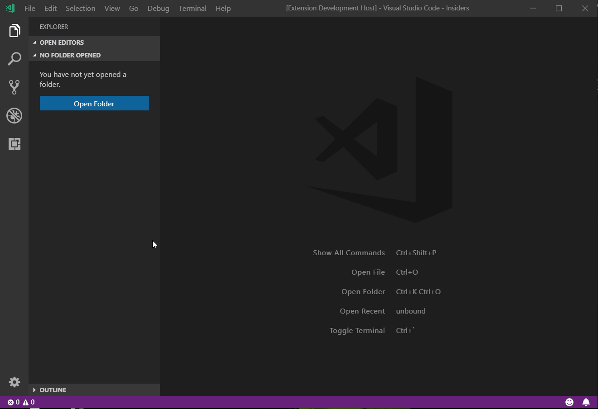
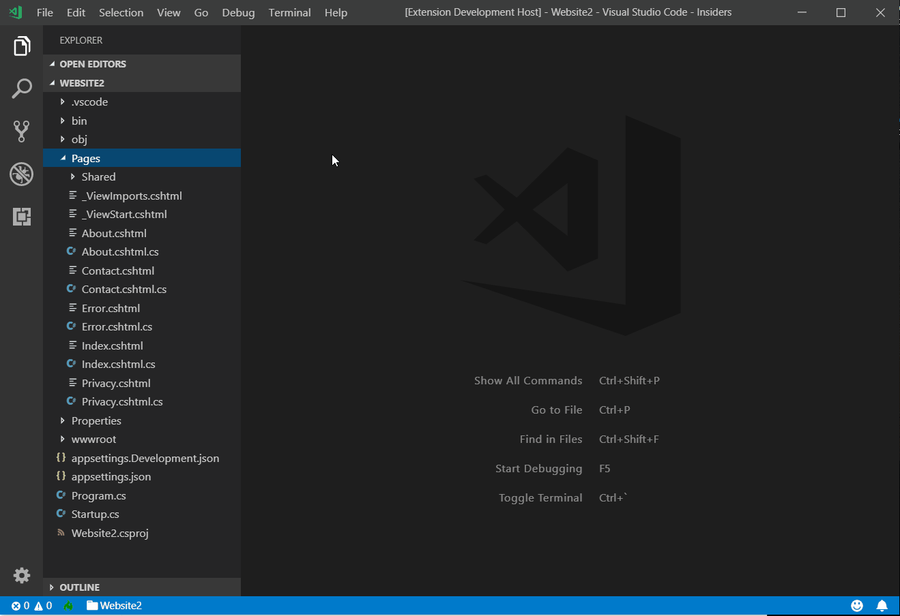

# VZ DotNet File Templates for Visual Studio Code

## Features

This extension adds new .NET Core 2.1 project and project item templates and wizards to template engine implemented by "VS File Templates" extension. As that engine allows to deliver multi-file templates inside another extension and to call external commands after template finishes generating files, some of the templates here use standard "dotnet new" command. 

## Requirements

"VZ File Templates" extension has to be installed as it contains core of templates selection and files generators.

## Extension Settings

## Known Issues

## Release Notes

### 0.0.1

Initial release of VZ DotNet File Templates

